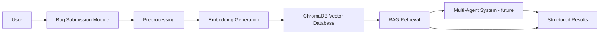

# Milestone 1 Documentation

## Introduction

AI Smart Bug Analyzer & Fix Advisor is a defect intelligence system for accepting new bug reports, building a historical defect knowledge base, and retrieving similar bugs with a Retrieval-Augmented Generation foundation. Milestone 1 focuses on retrieval, documentation, and system design. Multi-agent diagnosis and fix generation are planned for later milestones.

## Problem Statement

Software teams receive bug reports in inconsistent formats: summaries, long descriptions, stack traces, screenshots, error logs, and partial reproduction steps. Engineers often spend time manually searching historical issue trackers for duplicates, related failures, known root causes, and previously accepted fixes. The project addresses this by creating a searchable semantic defect knowledge base that can compare a new bug report against historical defects.

## Objectives

- Accept pasted bug reports and uploaded bug/log files.
- Standardize historical bug records into a shared schema.
- Clean, chunk, embed, and index defect data.
- Retrieve Top-K similar historical bugs for a submitted report.
- Document the future multi-agent architecture for triage, log analysis, root cause prediction, duplicate detection, and remediation advice.

## Research Summary

- Software defect workflow: defect reports move through intake, triage, reproduction, assignment, investigation, resolution, verification, and closure. Important fields include title, description, environment, steps, expected/actual behavior, severity, priority, component, logs, status, and resolution.
- Bug report structure: useful reports combine natural language and technical evidence. Stack traces and logs should be preserved because they contain high-signal identifiers such as class names, methods, exception types, paths, and error codes.
- RAG: Retrieval-Augmented Generation adds a retrieval step before generation, allowing an AI system to ground responses in external knowledge instead of relying only on model memory.
- Semantic similarity: embedding models transform text into vectors so related reports can be found even when they use different wording.
- Embeddings: Sentence Transformers provides pretrained models; `all-MiniLM-L6-v2` is a practical baseline because it is fast while retaining good general sentence embedding quality.
- Vector databases: ChromaDB collections store documents, metadata, and embeddings, then support similarity queries over the vector index.
- Multi-agent systems: future agents divide responsibilities across triage, log analysis, duplicate detection, root cause reasoning, and remediation.

References:

- FastAPI file uploads: https://fastapi.tiangolo.com/tutorial/request-files/
- ChromaDB collection add/query concepts: https://docs.trychroma.com/docs/collections/add-data
- Sentence Transformers pretrained models: https://sbert.net/docs/sentence_transformer/pretrained_models.html
- LangChain agent and retrieval-oriented application concepts: https://docs.langchain.com/oss/python/langchain/overview
- Original RAG paper: https://arxiv.org/abs/2005.11401
- Mozilla Bugzilla REST API: https://bugzilla.mozilla.org/rest/
- Apache issue trackers: https://issues.apache.org/
- Eclipse Bugzilla: https://bugs.eclipse.org/bugs/

## Technology Stack

Frontend: HTML, CSS, JavaScript.

Backend: Python, FastAPI, Uvicorn.

AI and RAG: Sentence Transformers using `sentence-transformers/all-MiniLM-L6-v2`, ChromaDB, optional LangChain/Ollama/OpenAI for later agentic generation.

Dataset sources: Mozilla Bugzilla, Apache issue trackers, Eclipse Bugzilla/Kaggle exports. This repository includes a small `data/raw/sample_bugs.csv` for local validation.

## System Architecture



Current Milestone 1 flow:

```text
User -> Bug Submission Module -> Preprocessing -> Embedding Generation -> Vector Database -> Top-K Similar Bugs
```

## Module Descriptions

1. Bug Submission Module: Web interface and API endpoint for pasted text, bug files, stack traces, and logs.
2. Historical Defect Knowledge Base: Stored collection of cleaned bug chunks, metadata, and embeddings.
3. RAG Pipeline: Generates a query embedding and retrieves semantically similar historical bugs.
4. Multi-Agent System: Designed for later milestones; agents will consume retrieved context and produce analysis.
5. Duplicate Detection Module: Future module that will classify whether a new report is a probable duplicate.
6. Structured Findings Module: Future module that will convert agent outputs into severity, root cause, evidence, and fix recommendations.
7. Analytics Module: Future module for defect trends, component hotspots, severity distribution, and retrieval quality.

## AI Agent Responsibilities

- Triage Agent: Classifies severity, priority, component, and routing hints.
- Log Analysis Agent: Extracts exceptions, stack frames, timestamps, repeated errors, and suspicious log sequences.
- Root Cause Agent: Predicts likely causes using submitted evidence and retrieved historical bugs.
- Duplicate Detection Agent: Compares the report with retrieved bugs and estimates duplicate probability.
- Remediation Agent: Suggests possible fixes, workarounds, owners, and validation steps.

## Knowledge Base Data Model

| Field | Purpose |
| --- | --- |
| Bug ID | Stable identifier from source tracker |
| Title | Short defect summary |
| Description | Detailed report, reproduction details, and observed behavior |
| Stack Trace | Exception and call stack evidence |
| Severity | Impact classification |
| Priority | Engineering/business urgency |
| Component | Product area or module |
| Resolution | Fixed, duplicate, wontfix, unresolved, etc. |
| Status | Open, closed, resolved, verified, etc. |
| Embedding Vector | Numeric semantic representation used for retrieval |

## RAG Pipeline Workflow

1. Load historical bug data from `data/raw/`.
2. Remove duplicates and normalize missing fields.
3. Clean text and standardize records.
4. Chunk long bug reports into smaller documents.
5. Generate embeddings for each chunk.
6. Store chunks, vectors, and metadata in ChromaDB or the JSON fallback store.
7. For a submitted report, generate a query embedding.
8. Retrieve Top-K similar bug chunks and return metadata plus snippets.

## Bug Submission Module

The frontend supports pasted bug reports plus three file inputs: bug file, stack trace, and error log. The backend receives multipart form data through FastAPI and combines all submitted content before retrieval.

## Dataset Details

The repo includes `data/raw/sample_bugs.csv` with Mozilla-style, Apache-style, and Eclipse-style sample records. Larger datasets should be exported into the same schema before preprocessing. The `data/raw/README.md` file lists source locations and required columns.

## Testing Results

Planned validation:

- Run `python scripts/prepare_sample_kb.py` to generate cleaned data, chunks, embeddings, and vector index.
- Run `pytest` to verify preprocessing, chunking, indexing, and retrieval behavior.
- Run `uvicorn app.main:app --reload` and submit a crash/log report through the UI.


