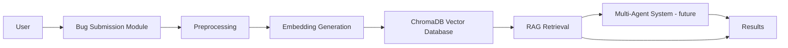

# System Architecture Diagram

```mermaid
flowchart LR
  User[User] --> Submit[Bug Submission Module]
  Submit --> Preprocess[Preprocessing]
  Preprocess --> Embed[Embedding Generation]
  Embed --> Store[ChromaDB Vector Database]
  Store --> Retrieval[RAG Retrieval]
  Retrieval --> Agents[Multi-Agent System - future]
  Agents --> Results[Results]
  Retrieval --> Results
```

Milestone 1 implements submission, preprocessing, embedding, storage, and retrieval. The Multi-Agent System is documented only.

